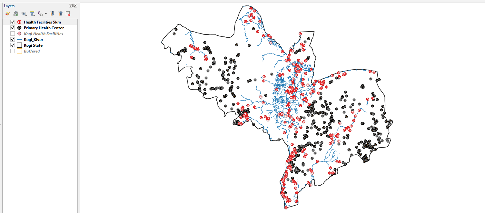

# geodev-lab-project
GIS buffer analysis identifying primary health centers within 5km of rivers in Kogi State, Nigeria. Built with QGIS as part of Geodev Lab Africa, Cohort One.

# My Geodev Lab Africa Project
"Which primary health centers in Kogi state are 5km close to the river"

Built over 12 months with Geodev Lab Africa, Cohort One.
See project-brief.md for the full details. 

.
